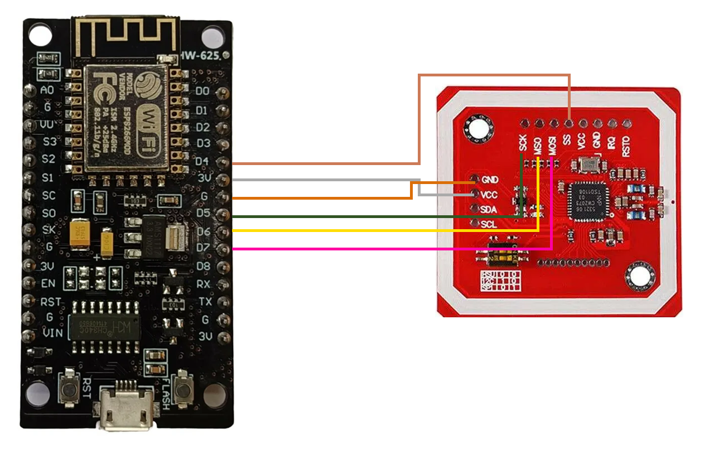

### Hardware Summary

This document provides a complete guide to our project, TransitPAY, which combines a PN532 NFC/RFID reader module with an ESP8266 (NodeMCU 1.0) board. It includes the correct wiring, the full, ready-to-use code, and key troubleshooting information.

---

### 1. Wiring Diagram (not visual)

This section outlines the final, correct wiring for the electronic components.

#### PN532 (SPI) to ESP8266 (NodeMCU)

- **PN532 `SS`** → **ESP8266 `D4`** (GPIO2)
- **PN532 `SCK`** → **ESP8266 `D5`** (GPIO14)
- **PN532 `MISO`** → **ESP8266 `D6`** (GPIO12)
- **PN532 `MOSI`** → **ESP8266 `D7`** (GPIO13)
- **PN532 `VCC`** → **ESP8266 `3.3V`**
- **PN532 `GND`** → **ESP8266 `GND`**

---

### 1. Wiring Diagram (Visual)

#### Take a reference to this image for wiring of your modules.

---

### 3. Key Troubleshooting and FAQs

#### **Q: Why does the Serial Monitor say "Waiting for a GPS fix..."?**

**A:** This is normal and not a hardware issue. The NEO-6M module requires a clear, open view of the sky to acquire a satellite signal. Take your project outdoors and wait 5-15 minutes for the first "cold start" fix.

#### **Q: Why am I getting an "MD5 of file does not match data in flash" error?**

**A:** This is a common flashing error, usually caused by a poor data connection.

- Use a **different, high-quality USB cable**.
- Try a **different USB port** on your computer.
- Disconnect the **PN532 and NEO-6M modules** while you upload the code, then reconnect them afterward.

#### **Q: The code won't upload at all.**

**A:** If you get a "Failed to connect" error, the board may not be in flash mode.

- Close the **Serial Monitor** and restart the window.
- Unplug and plug the USB-type B cable.
- Upload the code again.

#### **Q: Can I use different pins?**

**A:** Yes, for the PN532's `SS` pin , you can use any other available GPIO pins, but remember to update the pin definitions in the code accordingly. Do not use the same pin for two different data connections.
